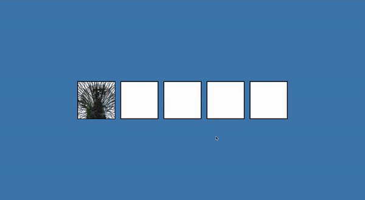

# 50 Projects in 50 Days - Drag N Drop

This is a code along project in the [50 Projects In 50 Days - HTML, CSS & JavaScript Udemy Course](https://www.udemy.com/course/50-projects-50-days/). Sharpen your skills by building 50 quick, unique & fun mini projects.

## Table of contents 😌

- [Overview](#overview)
  - [The project](#the-project)
  - [Screenshot](#screenshot)
  - [Links](#links)
- [My process](#my-process)
  - [Built with](#built-with)
  - [What I learned](#what-i-learned)
  - [Continued development](#continued-development)
  - [Code snippets](#im-really-proud-of-these-code-snippets%EF%B8%8F)
  - [Useful resources](#useful-resources)
- [Author](#author)
- [Acknowledgments](#acknowledgments)

## Overview👋🏾

Welcome to the 21<sup>th</sup> mini-project of the course!

### The project😥

In this project users will be able to:

- Build a responsive site that displays drag and drop animation.

### Screenshot🌇



### Links👩🏾‍💻

- Live Site URL: (https://clever-speculoos-6b1b39.netlify.app/)

## My process💭

This is a simple project that I started by marking out initial structure, and classes in HTML. Next I finalized the UI by styling the CSS. I styled the background, and each class created to utilize the aspects of the draggable attribute. I then added functionality by way of JavaScript to listen to every step of the draggable attribute and then add or remove classes accordingly.

### Built with👷🏾‍♀️

- Semantic HTML5 markup
- CSS custom properties
- Flexbox
- JavaScript

### What I learned👩🏾‍🏫

I learned how to make elements draggable using the drag events of the draggable attribute.

I also learned how to override the default action of an attribute.

### Continued development🔮

In the future I plan on continuing to practice positioning elements using flexbox, and using different selectors such as nth of type to select elements.

I also plan on continuing to practice using event listeners to make my pages more functional.

I also plan on continuing to learn the best ways to phrase git commits, so that future viewers can fully understand the changes that have occurred.

### I'm really proud of these code snippets✂️

```css
.fill {
  /* adds a random unsplash image that has the dimensions of 150px by 150px */
  background-image: url('https://source.unsplash.com/random/150x150');
  height: 145px;
  width: 145px;
  cursor: pointer;
}
```

```js
function dragStart() {
    this.className += ' hold'
    setTimeout(() => this.className = 'invisible', 0)
}
function dragEnd() {
    this.className = 'fill'
}
function dragOver(e) {
    e.preventDefault()
}
function dragEnter(e) {
    e.preventDefault()
    this.className += ' hovered'
}
function dragLeave() {
    this.className = ' empty'
}
function dragDrop() {
    this.className = 'empty'
    this.append(fill)
}
```

### Useful resources📖

- [Resource 1](https://developer.mozilla.org/en-US/docs/Web/API/HTML_Drag_and_Drop_API) - This is an amazing article which helped me write better comprehend the drag events of the draggable attribute. I'd recommend it to anyone still learning this concept.
- [Resource 2](https://developer.mozilla.org/en-US/docs/Web/API/Document/dragover_event) - This article detailed the dragover event. This was instrumental in resolving the default action issue I encountered.
- [Resource 3](https://developer.mozilla.org/en-US/docs/Web/API/Document/dragenter_event) - This article detailed the dragenter event. This was instrumental in resolving the default action issue I encountered.

## Author🔎

- Website - [Portfolio Site](https://maiannethornton.netlify.app/)
- Frontend Mentor - [@MaianneThornton](https://www.frontendmentor.io/profile/MaianneThornton)
- GitHub - [@MaianneThornton](GitHub.com/MaianneThornton)
- Twitter - [@MaianneThornton](https://twitter.com/MaianneThornton)
- LinkedIn - [@MaianneThornton](https://www.linkedin.com/in/maiannethornton/)

## Acknowledgments🙏🏾

Special Thanks go to [Brad Traversy](http://www.traversymedia.com/) and [Florin Pop](http://www.florin-pop.com/) creating the course and making reviewing concepts fun 😊.
